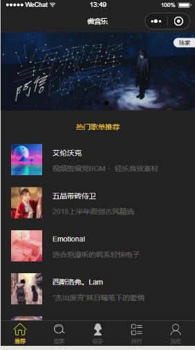
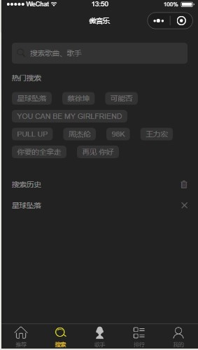
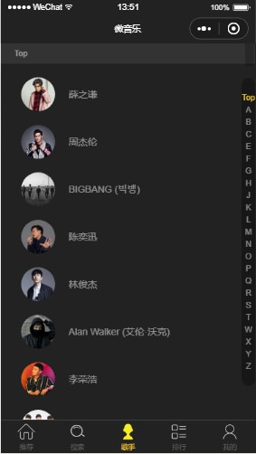
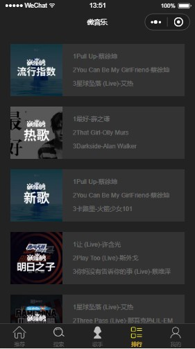
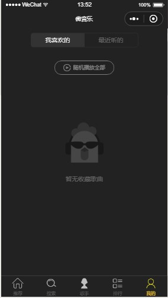
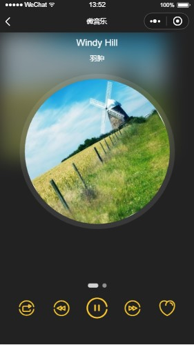

# mp-music

> 利用美团开源的MpVue框架，将之前学习的vue项目稍加改造，官方文档链接[MpVue](http://mpvue.com/)

## 项目启动
``` bash
# install dependencies
npm install

# serve with hot reload at localhost:8080
npm run dev

# build for production with minification
npm run build

```
## 运行效果







## 大体流程
+ 首先，确保你全局安装vue-cli，然后用vue init mpvue/mpvue-quickstart my-project 初始化一个MuVue项目
+ 将先前的vue项目复制进来
+ 别忘记修改自己的小程序 appid